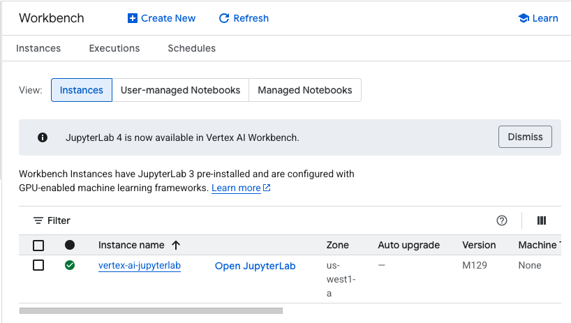
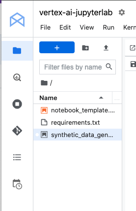
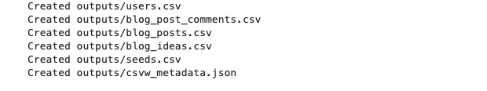

# GCP-LAB-Synthetic-Data-Generation-using-Gemini-APIs
Synthetic Data Generation using Gemini APIs


#### Overview

This lab explores using the Gemini API in Vertex AI to generate synthetic data using Snowfakery. Snowfakery is a powerful framework for creating complex fake data, and Gemini enhances this process by leveraging its natural language capabilities. You'll learn how to define data generation strategies, utilize predefined schemas, and generate different data formats (like blogs and comments) using a Wikipedia page as a seed. This approach is valuable for testing, prompt experimentation, and building few-shot examples.

##### Prerequisites
Before starting this lab, you should be familiar with:

. Basic Python programming.
. General API concepts.
. Running Python code in a Jupyter notebook on Vertex AI Workbench.


#####  Objectives
In this lab, you will:

. Interact with the Gemini API using the Google Gen AI SDK for Python.
. Utilize Snowfakery to define schemas and data generation strategies.
. Leverage Gemini to generate synthetic data in different formats.
. Explore practical applications of synthetic data generation, such as testing and prompt experimentation.

### Task 1. Open the notebook in Vertex AI Workbench

1. In the Google Cloud console, on the Navigation menu (Navigation menu icon), click Vertex AI > Workbench.

2. Find the vertex-ai-jupyterlab instance and click on the Open JupyterLab button.

The JupyterLab interface for your Workbench instance opens in a new browser tab.



### Task 2. Set up the notebook

1. Open the synthetic_data_generation_using_gemini file.

2. In the Select Kernel dialog, choose Python 3 from the list of available kernels.

3. Run through the Getting Started and the Import libraries sections of the notebook.

- For Project ID, use qwiklabs-gcp-00-152e07c39683, and for Location, use us-west1.




##### Snowfakery
Snowfakery is a framework for generating complex fake data at scale. It has a lot of in-built plugins, and allows you to extend its functionality by writing your own plugins.

##### Objectives
This repository demonstrates how Gemini can be leveraged as a Snowfakery plugin for generating synthetic data based on a set of predefined schemas and data generation strategies. The framework is based on Snowfakery which is itself based on Faker. It requires the expected outputs to be codified in a YAML file per Snowfakery specs, detailing all the required fields and their respective data generation strategies. The framework currently supports 3 such strategies:

1. Static Values - can be included in the YAML file itself.
2. Faker based values - Leverages the Faker library to generate fake data.
3. LLM based values - Leverages an LLM call and a predefined prompt template to generate data

It is also possible to use arbitrary python functions to generate data and augment the pipeline. Interrelated schemas are also supported where the value of a given field depends on an already defined field, which allows us to create hierarchical data and complex schemas. The data generated via this framework is saved to a CSV file for further analysis / consumption.

Although this notebook can be used for any synthetic-data generation use-case and schema, the current examples shows the simple use case of generating long (blogs) and short (comments) format contents using a given Wikipedia page as the seed data. While the primary purpose of the synthetic data generation pipeline is to generate data for testing, this can also be used to support tangential use-cases like running prompt experiments and comparisons at scale, building few-shot examples, evaluating fine-tuned models, etc.

#### Getting Started
Install Vertex AI SDK for Python and other dependencies

`%pip install --upgrade --user -q google-cloud-aiplatform snowfakery==3.6.2 wikipedia-api==0.6.0`

##### Set Google Cloud project information and initialize Vertex AI SDK
To get started using Vertex AI, you must have an existing Google Cloud project and enable the Vertex AI API.

```
import os

PROJECT_ID = "qwiklabs-gcp-00-152e07c39683"  # Update with your lab Project ID
LOCATION = "us-west1" # Update with your lab region
if not PROJECT_ID or PROJECT_ID == "qwiklabs-gcp-00-152e07c39683":
    PROJECT_ID = str(os.environ.get("GOOGLE_CLOUD_PROJECT"))

# Initialize Vertex AI
import vertexai
vertexai.init(project=PROJECT_ID, location=LOCATION)

```

##### Restart runtime
To use the newly installed packages in this Jupyter runtime, you must restart the runtime. You can do this by running the cell below, which restarts the current kernel.

The restart might take a minute or longer. After it's restarted, continue to the next step.

```
import IPython

app = IPython.Application.instance()
app.kernel.do_shutdown(True)
```

##### Import libraries

```
from io import StringIO
import logging
import sys
import types

import jinja2
from snowfakery import generate_data
from snowfakery.plugins import SnowfakeryPlugin
from vertexai.generative_models import GenerationConfig, GenerativeModel
import wikipediaapi
```

##### Creating Plugins and Prompts
The following cells create the 2 custom plugins we need for this use case along with the needed prompts.

###### Creating Plugins
The first plugin gives us the ability to interact with Wikipedia and fetch the contents for a given page. The second plugin allows us to interact with the Gemini API.


```
class SyntheticDataGeneration:
    """
    Implements all the extra functionality needed for this use-case
    """

    class Plugins(types.ModuleType):
        """
        Provides the plugins needed to extend Snowfakery
        """

        class Gemini(SnowfakeryPlugin):
            """
            Plugin for interacting with Gemini.
            """

            class Functions:
                """
                Functions to implement field / object level data generation
                """

                model: GenerativeModel = GenerativeModel("gemini-2.0-flash")

                def fill_prompt(self, prompt_name: str, **kwargs) -> str:
                    """
                    Returns a formatted prompt
                    """
                    return (
                        jinja2.Environment(
                            loader=jinja2.FileSystemLoader(searchpath="./")
                        )
                        .get_template(prompt_name)
                        .render(**kwargs)
                    )

                def generate(
                    self,
                    prompt_name: str,
                    temperature=0.9,
                    top_p=1,
                    **kwargs,
                ) -> str | None:
                    """
                    A wrapper around Gemini plugin
                    """
                    logging.info("Preparing Prompt %s with %s", prompt_name, kwargs)
                    prompt = self.fill_prompt(prompt_name, **kwargs)
                    logging.info("Prompt %s Prepared", prompt_name)
                    try:
                        logging.info("Calling Gemini For %s", prompt_name)
                        response = self.model.generate_content(
                            prompt,
                            generation_config=GenerationConfig(
                                temperature=temperature,
                                max_output_tokens=8192,
                                top_p=top_p,
                            ),
                        )
                    except Exception as e:
                        logging.trace(
                            (
                                "Unable to generate text using %s.\n"
                                "Prepared Prompt: \n%s\n\nError: %s"
                            ),
                            prompt_name,
                            prompt,
                            e,
                        )
                        return None

                    try:
                        return response.text
                    except Exception as e:
                        logging.trace(
                            (
                                "Unable to generate text using %s.\n"
                                "Prepared Prompt: \n%s\n\n"
                                "Received Response: \n%s\n\n"
                                "Error: %s"
                            ),
                            prompt_name,
                            prompt,
                            response,
                            e,
                        )
                        return None

        class Wikipedia(SnowfakeryPlugin):
            """
            Plugin for interacting with Wikipedia.
            """

            class Functions:
                """
                Implements a single function to fetch a Wikipedia page
                """

                def get_page(self, title: str):
                    """
                    Returns the title, URL and sections of the given wikipedia page
                    """
                    logging.info("Parsing Wikipedia Page %s", title)
                    page = wikipediaapi.Wikipedia(
                        "Snowfakery (example@google.com)", "en"
                    ).page(title)
                    results = {"sections": {}, "title": page.title, "url": page.fullurl}
                    sections = [(s.title, s) for s in page.sections]
                    while sections:
                        sec_title, sec_obj = sections.pop()
                        if sec_title in [
                            "External links",
                            "References",
                            "See also",
                            "Further reading",
                        ]:
                            continue
                        if sec_obj.text:
                            results["sections"][sec_title] = sec_obj.text
                        for sub_sec in sec_obj.sections:
                            sections.append((f"{sec_title} - {sub_sec.title}", sub_sec))
                    logging.info("Parsing Wikipedia Page %s Complete", title)
                    return results

```

##### Making plugins discoverable
We add the created class to sys.modules to ensure Snowfakery can find them and import them as modules as needed.

```
sys.modules["SyntheticDataGeneration.Plugins"] = SyntheticDataGeneration.Plugins(
    name="SyntheticDataGeneration.Plugins"
)
```

##### Creating Prompt Templates
We add the created class to sys.modules to ensure Snowfakery can find them and import them as modules as needed.


```
%%writefile blog_generator.jinja
You are an expert content creator who writes detailed, factual blogs.
You have been asked to write a blog about {{idea_title}}.
To get you started, you have also been given the following context about the topic:

{{idea_body}}

Ensure the blog that you write is interesting,detailed and factual.
Take a deep breath and start writing:

```

>Writing blog_generator.jinja


```
%%writefile comment_generator.jinja
You are {{first_name}} {{last_name}}. You are {{age}} years old. You are interested in {{interests}}. You work at {{organization}} as a {{profession}}.
You came across the following article:

{{blog_title}}

{{blog_body}}

Present your thoughts and feelings about the article in a short comment.

Comment:
```
>Writing comment_generator.jinja


##### Creating the Recipe
In order to generate synthetic data, the schema of the synthetic data must be defined first. This is done by creating a recipe in a YAML format as demonstrated below, more details on writing recipes can be found here.


```
recipe = """
- plugin: SyntheticDataGeneration.Plugins.Wikipedia
- plugin: SyntheticDataGeneration.Plugins.Gemini
- option: wiki_title
- var: __seed
  value:
    - Wikipedia.get_page :
      title : ${{wiki_title}}

- object : users
  count : ${{random_number(min=100, max=500)}}
  fields :
    first_name : ${{fake.FirstName}}
    last_name : ${{fake.FirstName}}
    age:
      random_number:
        min: 18
        max: 95
    email : ${{fake.Email}}
    phone : ${{fake.PhoneNumber}}
    interests : ${{fake.Bs}}
    postal_code : ${{fake.Postalcode}}
    organization : ${{fake.Company}}
    profession : ${{fake.Job}}

- object : seeds
  fields :
    title : ${{__seed['title']}}
    url : ${{__seed['url']}}
    section_count : ${{__seed['sections'] | length}}

  friends:
    - object : blog_ideas
      count : ${{seeds.section_count}}
      fields :
        seed_id : ${{seeds.id}}
        section : ${{(__seed.sections.keys() | list)[child_index]}}
        body : ${{__seed.sections[section]}}

      friends:
        - object : blog_posts
          fields :
            blog_idea_id : ${{blog_ideas.id}}
            title : ${{seeds.title}} - ${{blog_ideas.section}}
            body :
              - Gemini.generate:
                prompt_name : blog_generator.jinja
                idea_title : ${{title}}
                idea_body : ${{blog_ideas.body}}
            author : Gemini

          friends:
            - object : blog_post_comments
              fields :
                blog_post_id : ${{blog_posts.id}}
                author_id :
                  random_reference : users
                author_email : ${{author_id.email}}
                comment :
                  - Gemini.generate:
                    prompt_name : comment_generator.jinja
                    first_name : ${{author_id.first_name}}
                    last_name : ${{author_id.last_name}}
                    age : ${{author_id.age}}
                    interests : ${{author_id.interests}}
                    organization : ${{author_id.organization}}
                    profession : ${{author_id.profession}}
                    blog_title : ${{blog_posts.title}}
                    blog_body : ${{blog_posts.body | truncate(1000)}}
"""
```

##### Generating Data

```
generate_data(
    StringIO(recipe),
    output_format="csv",
    output_folder="outputs",
    user_options={"wiki_title": "Python_(programming_language)"},
)
```



##### Results
The synthetic data has been generated and stored as CSV files in the outputs folder.

[Users.cvs](outputs/users.csv)

[blog_post_comments.csv](outputs/blog_post_comments.csv)

[outputs/blog_posts.csv](outputs/blog_posts.csv)

[blog_ideas.csv](outputs/blog_ideas.csv)

[seeds.csv](outputs/seeds.csv)

[csvw_metadata.json](outputs/csvw_metadata.json)


